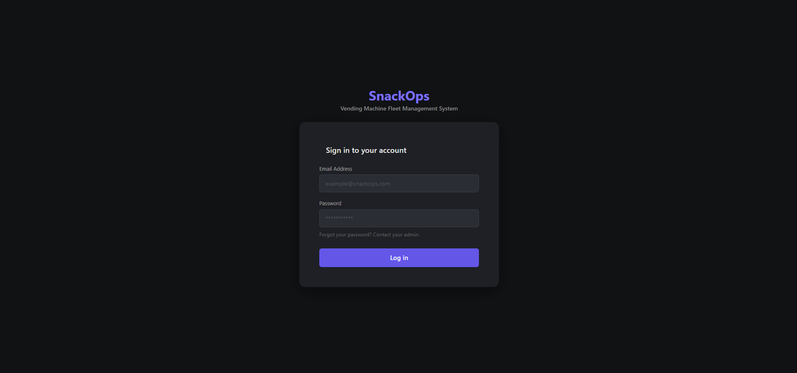
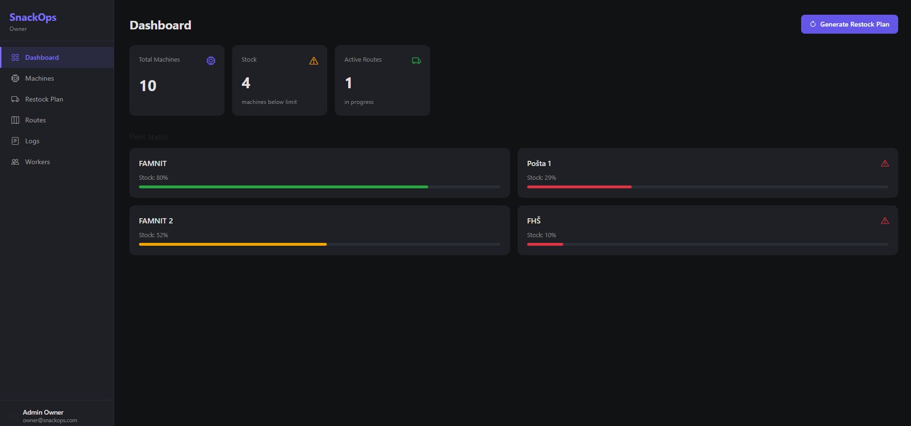
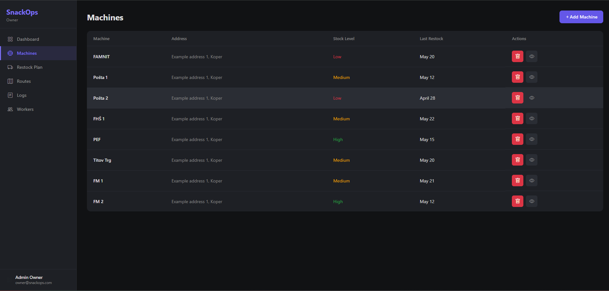
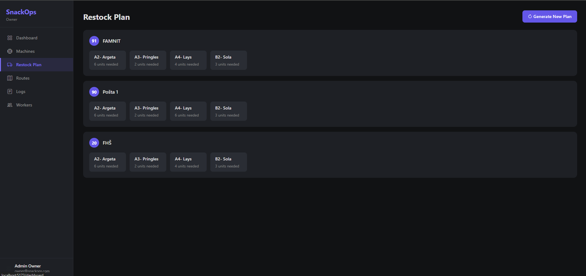
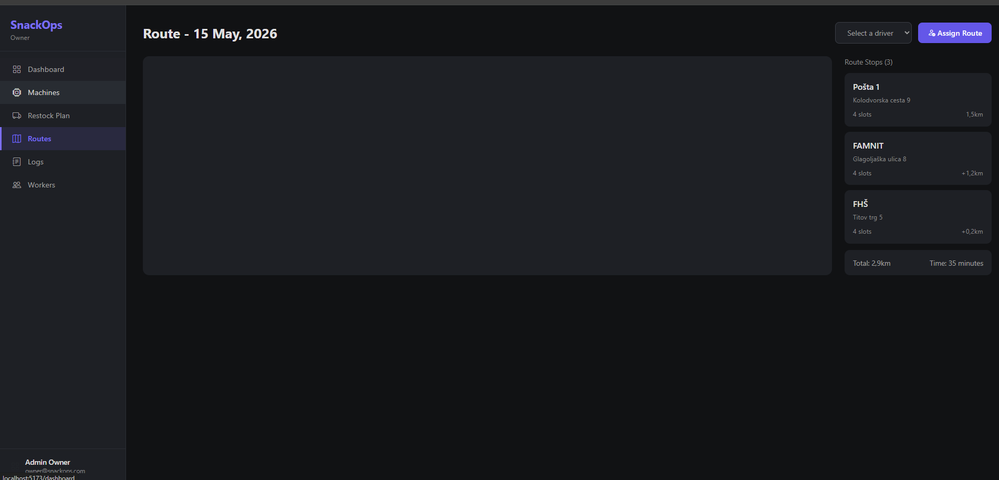
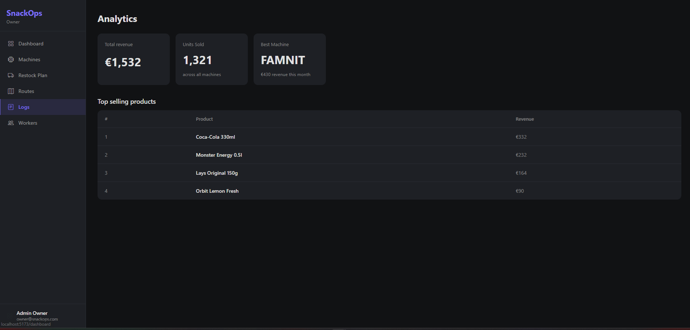
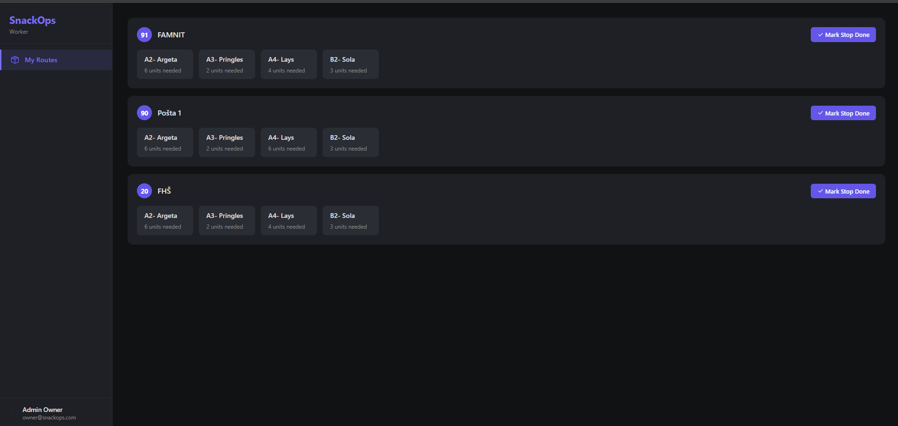

# SnackOps

A web application for managing a vending machine fleet - built as a university project at UP FAMNIT. 

> ! This project connects to a protected university database and cannot be run locally without access to it. Screenshots below show the full application.!

## Features

**Owner view**
- Dashboard with live fleet status
- Machine management
- Automatic restock plan generation 
- Route planning
- Analytics
- Worker management

**Worker view**
- Personal route view
- Mark stops as done as the route is completed.

## Screenshots

### Login

### Dashboard

### Machines

### Restock Plan

### Routes

### Analytics

### Worker view

## In development
- Map integration (Google Maps / Leaflet) for visual route display
- Wiring to frontend to backend

